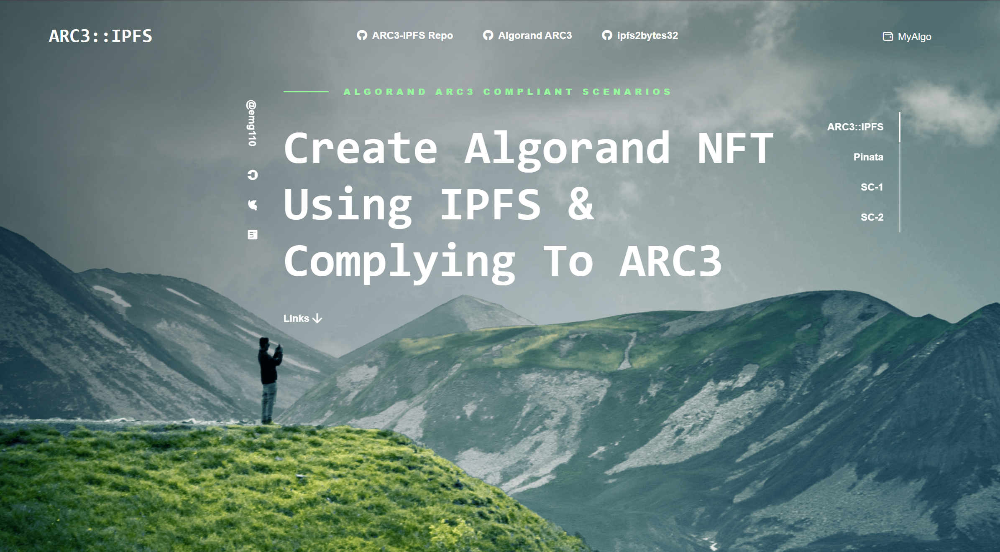

# NFT ARC3::IPFS
This repository is a simple implementation of Algorand ASA based NFT generation scenarios, using IPFS integration with emphasis on usage of metadatahash & URL fields of ASA, in compliance to ARC3 convention.

## This is WORK IN PROGRESS.

[Algorand ARC0003 discussion](https://github.com/algorandfoundation/ARCs/issues/3)

[Algorand ARC0003](https://github.com/algorandfoundation/ARCs/blob/main/ARCs/arc-0003.md)

[ARC0003 Related comment](https://github.com/algorandfoundation/ARCs/issues/3#issuecomment-913541426)

[Algorand Developers Portal Solution](https://developer.algorand.org/solutions/working-algorand-nfts-and-ipfs/)

[IPFS2BYTES32 Gists and examples repo](https://github.com/emg110/ipfs2bytes32)

